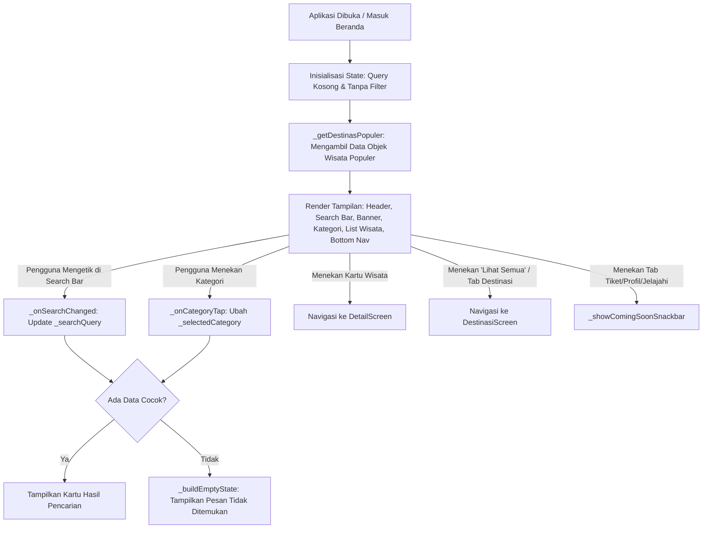

# Dokumentasi Halaman Beranda (Travio)

Dokumen ini menjelaskan struktur file, peran arsitektur, variabel state, seluruh method/fungsi, dan alur kerja (*data flow*) pada **Halaman Beranda** aplikasi Travio.

---

## 1. File yang Terlibat & Perannya

Halaman Beranda dibangun dengan pendekatan modular yang memisahkan antara antarmuka (UI), logika data, model, serta modul utilitas pendukung:

| Nama File | Lokasi | Peran & Tanggung Jawab |
|---|---|---|
| **`beranda_screen.dart`** | `lib/screens/` | **File Utama UI & State Beranda**. Menangani input pengguna (pencarian, pemilihan kategori, navigasi menu), mengatur tata letak komponen (*header, banner, list horizontal*), dan mengelola perpindahan halaman. |
| **`objek_wisata.dart`** | `lib/models/` | **Model Data**. Mendefinisikan struktur objek `ObjekWisata` (nama, jenis/kategori, harga tiket dewasa & anak, kuota harian, rating, lokasi, gambar, dan status populer). |
| **`wisata_data.dart`** | `lib/data/` | **Sumber Data Mock/Lokal**. Menyediakan fungsi `getSemuaWisata()` yang mengembalikan 16 destinasi wisata di Indonesia dalam 4 kategori (Alam, Air, Edukasi, Budaya). |
| **`app_colors.dart`** | `lib/utils/` | **Palet Warna Desain**. Menyediakan konstanta warna tema aplikasi: `primary` (#6EC1FF), `secondary` (#68F4FF), `surface` (#F7FAFF), dan `accent` (#3B82F6). |
| **`formatter.dart`** | `lib/utils/` | **Helper Format Teks**. Menyediakan fungsi pemformatan angka menjadi mata uang Rupiah (`formatRupiah`) dan penyederhanaan jumlah ulasan (`formatUlasan`, contoh: `1200` → `1.2k`). |
| **`destinasi_screen.dart`** | `lib/screens/` | **Tujuan Navigasi (Katalog)**. Dibuka saat pengguna menekan tab *"Destinasi"* pada navigasi bawah atau tombol *"Lihat Semua"*. |
| **`detail_screen.dart`** | `lib/screens/` | **Tujuan Navigasi (Detail)**. Dibuka saat salah satu kartu destinasi populer ditekan. |

---

## 2. Variabel State pada `_BerandaScreenState`

Di dalam kelas `_BerandaScreenState`, terdapat beberapa variabel yang mengontrol status tampilan secara dinamis:

* **`int _selectedNavIndex = 0`**: Menyimpan indeks menu yang aktif pada *Bottom Navigation Bar* (0: Beranda, 1: Destinasi, 2: Tiket, 3: Profil).
* **`TextEditingController _searchController`**: Mengontrol teks di dalam form *Search Bar*.
* **`String _searchQuery = ''`**: Menyimpan kata kunci pencarian yang sedang diketik oleh pengguna.
* **`String? _selectedCategory`**: Menyimpan kategori wisata yang sedang dipilih (`Alam`, `Air`, `Edukasi`, `Budaya`), atau bernilai `null` jika tidak ada kategori yang aktif (menampilkan default destinasi populer).
* **`static const List<Map<String, dynamic>> _daftarKategori`**: Daftar statis yang menyimpan pasangan nama label kategori beserta ikon Materialnya.

---

## 3. Daftar Method/Fungsi & Perannya

### A. Fungsi Logika & Pengolahan Data

#### 1. `List<ObjekWisata> _getDestinasPopuler()`
* **Peran**: Memfilter daftar destinasi yang akan ditampilkan pada daftar horizontal di beranda.
* **Alur**:
  1. Mengambil seluruh data dari `getSemuaWisata()`.
  2. Mengecek apakah kata kunci `_searchQuery` cocok dengan nama objek, lokasi, atau kategori.
  3. Mengecek kecocokan kategori dengan `_selectedCategory` (jika dipilih).
  4. Jika pencarian atau filter kategori aktif, mengembalikan seluruh hasil yang cocok. Jika tidak aktif (kondisi default), hanya mengembalikan objek wisata yang memiliki properti `isPopuler == true`.

#### 2. `void _onCategoryTap(String category)`
* **Peran**: Menangani pemilihan kategori pada tombol icon bulat.
* **Alur**: Jika kategori yang diklik sudah aktif, batalkan pilihan (`_selectedCategory = null`). Jika belum, ubah `_selectedCategory = category`. Memanggil `setState()` agar daftar wisata langsung diperbarui.

#### 3. `void _onSearchChanged(String value)`
* **Peran**: Memperbarui state `_searchQuery` secara *real-time* saat pengguna mengetik huruf di form pencarian melalui `setState()`.

#### 4. `void _clearSearch()`
* **Peran**: Mengosongkan teks pada controller form dan mereset `_searchQuery` menjadi string kosong.

---

### B. Fungsi Event & Navigasi

#### 1. `void _onNavTap(int index)`
* **Peran**: Mengatur aksi ketika salah satu tab pada *Bottom Navigation Bar* ditekan.
* **Alur**:
  * Jika tab **Destinasi** (indeks 1) ditekan: Mengarahkan pengguna ke `DestinasiScreen` menggunakan `Navigator.push`.
  * Jika tab **Tiket** atau **Profil** ditekan: Menampilkan notifikasi *coming soon* via `_showComingSoonSnackbar()`.
  * Jika tab **Beranda** (indeks 0): Mengubah `_selectedNavIndex = 0`.

#### 2. `void _showComingSoonSnackbar([String? pesan])`
* **Peran**: Menampilkan *floating snackbar* pemberitahuan bahwa fitur tersebut sedang dalam tahap pengembangan.

#### 3. `void dispose()`
* **Peran**: Siklus hidup widget Flutter (*lifecycle*). Membersihkan `_searchController` dari memori saat halaman dihancurkan guna mencegah kebocoran memori (*memory leak*).

---

### C. Metode Pembangun Antarmuka (Widget Builders)

| Nama Method | Peran Tampilan |
|---|---|
| **`build(BuildContext context)`** | Struktur utama halaman: Menggabungkan `SafeArea`, `SingleChildScrollView`, seluruh seksi konten vertikal, dan `bottomNavigationBar`. |
| **`_buildHeader()` & `_buildHeaderTeks()`** | Menampilkan teks sapaan *"Selamat datang, Jelajahi Indonesia"* serta deskripsi singkat aplikasi. |
| **`_buildAvatarButton()`** | Menampilkan ikon profil lingkaran di sisi kanan atas header. |
| **`_buildSearchBar()`** | Menampilkan kolom input pencarian putih dengan efek bayangan (*shadow*), ikon kaca pembesar, dan tombol silang (x) untuk hapus teks. |
| **`_buildHeroBanner()`** | Menampilkan kartu banner visual promosi berukuran besar. |
| **`_buildBannerGambar()` & `_buildBannerOverlay()`** | Merender foto latar belakang Gunung Bromo dengan lapisan gradien gelap agar teks di atasnya terbaca jelas. |
| **`_buildBannerKonten()` & `_buildJelajahiButton()`** | Menampilkan slogan *"Pesona Alam di Setiap Langkah"* dan tombol aksi *"Jelajahi Sekarang"*. |
| **`_buildKategori()` & `_buildItemKategori()`** | Merender 4 tombol ikon kategori (Alam, Air, Edukasi, Budaya) dengan efek animasi warna aktif/non-aktif. |
| **`_buildSeksiDestinasPopuler()`** | Kontainer seksi destinasi: Berisi header seksi dan daftar kartu atau *empty state*. |
| **`_buildHeaderSeksi()`** | Menampilkan judul seksi yang dinamis (misal *"Wisata Alam"* atau *"Destinasi Populer"*) serta link tombol *"Lihat Semua"* yang mengarah ke `DestinasiScreen`. |
| **`_buildListPopuler()`** | Menyusun kartu destinasi ke dalam `ListView` horizontal yang mulus (*bouncing scroll*). |
| **`_buildKartuPopuler()`** | Komponen kartu wisata individual: Diberi gesture sentuh yang mengarahkan ke `DetailScreen(wisata: wisata)`. |
| **`_buildKartuGambar()` & `_buildGambarWisata()`** | Merender foto thumbnail objek wisata dan badge jenis wisata di pojok kanan atas gambar dengan penanganan error. |
| **`_buildKartuInfo()`** | Menampilkan detail teks pada kartu: Nama objek, lokasi, rating bintang & jumlah ulasan, serta harga tiket per orang. |
| **`_buildEmptyState()`** | Tampilan ramah pengguna (ikon pencarian kosong + teks saran) jika tidak ada destinasi yang sesuai dengan filter/pencarian. |
| **`_buildBottomNav()`** | Merender bilah navigasi bawah (*BottomNavigationBar*) dengan 4 menu utama: Beranda, Destinasi, Tiket, dan Profil. |

---

## 4. Diagram Alur Kerja Halaman Beranda

---

## 5. Ringkasan Singkat

1. **Struktur**: `beranda_screen.dart` berperan sebagai etalase utama yang menghubungkan pengguna dengan seluruh fitur Travio.
2. **Reaktivitas**: Menggunakan `StatefulWidget` dengan `setState()` sehingga pencarian teks dan filter kategori langsung mengubah daftar destinasi tanpa perlu memuat ulang halaman.
3. **Keterhubungan**: Terintegrasi langsung dengan `DestinasiScreen` (katalog menyeluruh) dan `DetailScreen` (rincian satu objek wisata).
